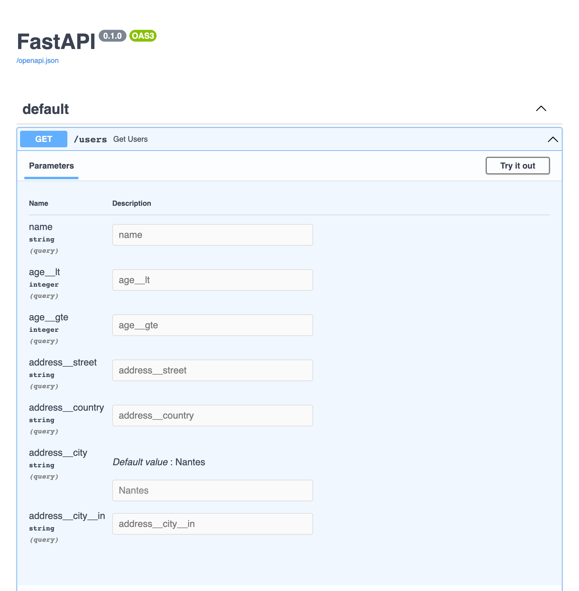

# FastAPI Filter

Add querystring filters to your api endpoints and show them in the swagger UI.

The supported backends are [SQLAlchemy](https://github.com/sqlalchemy/sqlalchemy) and
[MongoEngine](https://github.com/MongoEngine/mongoengine).


## Example



## Filter

The philosophy of **fastapi_filter** is to be very declarative. You define the fields you want to be able to filter on
as well as the type of operator, then tie your filter to a specific model.

### Examples

[SQLAlchemy](https://github.com/arthurio/fastapi-filter/blob/main/examples/fastapi_filter_sqlalchemy.py)

[MongoEngine](https://github.com/arthurio/fastapi-filter/blob/main/examples/fastapi_filter_mongoengine.py)

### Operators

By default, **fastapi_filter** supports the following operators:

  - `neq`
  - `gt`
  - `gte`
  - `in`
  - `isnull`
  - `lt`
  - `lte`
  - `not`/`ne`
  - `not_in`/`nin`
  - `like`/`ilike`

_**Note:** Mysql excludes `None` values when using `in` filter_

For the list related operators (`in`, `not_in`), simply pass a comma separated list of strings to your api endpoint and
they will be converted into the list of the type you defined.

For example, if the filter field is `age__in`, you can send `?age__in=1,3,5,7,9`.

### Related fields

As long as you setup your query to join your related models, it's pretty straightforward to add related field filters
and even re-use existing filters for their models.

As you can see in the examples, all it takes is something along the lines of:

```python hl_lines="21"
from typing import Optional

class AddressFilter(Filter):
    street: Optional[str]
    country: Optional[str]
    city__in: Optional[list[str]]

    class Constants(Filter.Constants):
        model = Address


class UserFilter(Filter):
    name: Optional[str]
    address: Optional[AddressFilter] = FilterDepends(with_prefix("address", AddressFilter))

    class Constants(Filter.Constants):
        model = User

@app.get("/users", response_model=list[UserOut])
async def get_users(user_filter: UserFilter = FilterDepends(UserFilter), db: AsyncSession = Depends(get_db)) -> Any:
    query = user_filter.filter(select(User).outerjoin(Address))   # (1)
    result = await db.execute(query)
    return result.scalars().all()
```

1. See how we need to join with the Address model to be able to filter on it?

The `with_prefix` wrapper function sets the prefix for your filters, so in that example you would use
`?address__city_in=Nantes,Boston` for example.

### FilterDepends

[link](https://github.com/arthurio/fastapi-filter/blob/main/fastapi_filter/base/filter.py#L87)

Wherever you would use a `Depends`, replace it with `FilterDepends` if you are passing a filter class. The reason is
that `FilterDepends` converts the `list` filter fields to `str` so that they can be displayed and used in swagger.
It also handles turning `ValidationError` into `HTTPException(status_code=422)`.


### with_prefix

[link](https://github.com/arthurio/fastapi-filter/blob/main/fastapi_filter/base/filter.py#L21)

This is a utility function that will take an existing filter and prefix all its fields with a given value. It's mostly
used for filtering related fields.

The following would be equivalent:

```python
from typing import Optional

class AddressFilter(Filter):
    street: Optional[str]
    country: Optional[str]

    class Constants(Filter.Constants):
        model = Address


class UserFilter(Filter):
    name: Optional[str]
    address: Optional[AddressFilter] = FilterDepends(with_prefix("address", AddressFilter))

    class Constants(Filter.Constants):
        model = User
```

AND

```python
class UserFilter(Filter):
    name: Optional[str]
    address__street: Optional[str]
    address__country: Optional[str]
```

## Order by

There is a specific field on the filter class that can be used for ordering. The default name is `order_by` and it
takes a list of string. From an API call perspective, just like the `__in` filters, you simply pass a comma separated
list of strings.

You can change the **direction** of the sorting (*asc* or *desc*) by prefixing with `-` or `+` (Optional, it's the
default behavior if omitted).

If you don't want to allow ordering on your filter, just don't add `order_by` as a field and you are all set.


### Example - Basic

```python
from typing import Optional
from fastapi_filter.contrib.sqlalchemy import Filter

class UserFilter(Filter):
    order_by: Optional[list[str]]

@app.get("/users", response_model=list[UserOut])
async def get_users(
    user_filter: UserFilter = FilterDepends(UserFilter),
    db: AsyncSession = Depends(get_db),
) -> Any:
    query = select(User)
    query = user_filter.sort(query)
    result = await db.execute(query)
    return result.scalars().all()
```

Valid urls:

```bash
/users?order_by=age,-created_at
/users
/users?order_by=-name
/users?order_by=+id
```

### Example - Custom name

If for some reason you can't or don't want to use `order_by` as the field name for ordering, you can override it:

```python
from typing import Optional
from fastapi_filter.contrib.sqlalchemy import Filter

class UserFilter(Filter):
    class Constants(Filter.Constants):
        model = User
        ordering_field_name = "custom_order_by"

    custom_order_by: Optional[list[str]]

@app.get("/users", response_model=list[UserOut])
async def get_users(
    user_filter: UserFilter = FilterDepends(UserFilter),
    db: AsyncSession = Depends(get_db),
) -> Any:
    query = select(User)
    query = user_filter.sort(query)
    result = await db.execute(query)
    return result.scalars().all()
```

Valid urls:

```bash
curl /users?custom_order_by=age,-created_at
curl /users
curl /users?custom_order_by=-name
curl /users?custom_order_by=+id
```

### Restrict the `order_by` values

Add the following validator to your filter class:

```python
from typing import Optional
from fastapi_filter.contrib.sqlalchemy import Filter
from pydantic import validator

class MyFilter(Filter):
    order_by: Optional[list[str]]

    @validator("order_by")
    def restrict_sortable_fields(cls, value):
        if value is None:
            return None

        allowed_field_names = ["age", "id"]

        for field_name in value:
            field_name = field_name.replace("+", "").replace("-", "")  # (1)
            if field_name not in allowed_field_names:
                raise ValueError(f"You may only sort by: {', '.join(allowed_field_names)}")

        return value
```

1. If you want to restrict only on specific directions, like `-created_at` and `name` for example, you can remove this
line. Your `allowed_field_names` would be something like `["age", "-age", "-created_at"]`.
